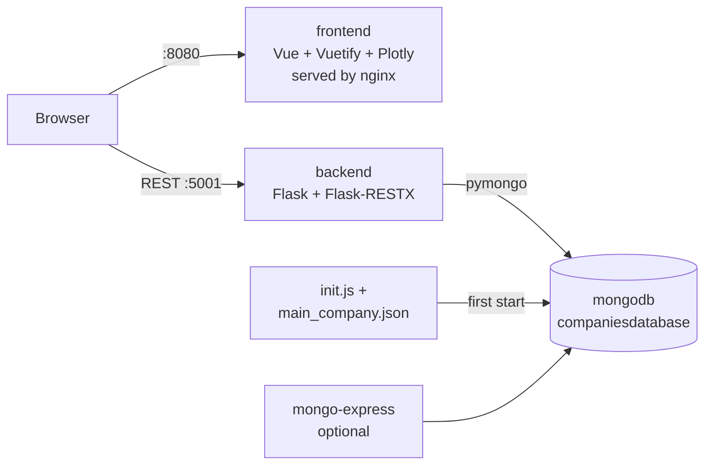

<div align="center">

# IVDA Tutorial

**A Vue.js and Flask company dashboard, built by following the IVDA web app tutorial, plus my feedback on that tutorial**


[Quick start](#quick-start) · [Tutorial](#tutorial) · [Feedback](comments.md) · [API](#api)

</div>

In fall 2023, I worked through the web app tutorial of the [Interactive Visual Data Analysis (IVDA)](#context) course
at the University of Zurich before the students got it as Assignment 1. I built the example app step by step, wrote
down the commands I needed and collected feedback for the IVDA group. This repository holds the tutorial, the app I
built and that feedback.

## Features

- 📊 **Company dashboard**: scatter plot (founding year vs. employees, coloured by category), profit line plot, and a
  bar plot that compares the employees of a company with the other companies in its category
- 🔗 **Linked views**: pick a category or a company in the configuration panel, or click a point in the scatter plot
- 🔮 **Profit prediction** for 2022: repeat the last value (`random`) or fit an autoregressive model (`regression`,
  statsmodels `AutoReg`)
- 🐳 **One command** starts MongoDB with mock data, the Flask API and the frontend
- 📝 **Tutorial feedback** in [`comments.md`](comments.md) and my command log in [`commands.md`](commands.md)

> [!NOTE]
> The tutorial text in `ivda-tutorial-tutorial-*` is the IVDA group's material from fall 2023 and is kept unchanged.
> My own work is the app in [`services/`](services), the Docker setup and the two Markdown files above.

> [!TIP]
> The state from October 2023 (Vue CLI, Vuetify 3 beta, Flask run locally, MongoDB in Docker) is tagged
> [`v1.0.0`](../../tree/v1.0.0). Version 2 updates the app and the Docker setup to current versions; the tutorial steps
> still describe the 2023 setup. The project is not developed further.

## Contents

- [Context](#context)
- [Tech stack](#tech-stack)
- [Architecture](#architecture)
- [Repository structure](#repository-structure)
- [Quick start](#quick-start)
- [Services and ports](#services-and-ports)
- [Configuration](#configuration)
- [API](#api)
- [Tutorial](#tutorial)
- [Data](#data)
- [Development](#development)
- [Changes in version 2](#changes-in-version-2)
- [Known issues](#known-issues)
- [Acknowledgements](#acknowledgements)
- [License](#license)
- [Author](#author)

## Context

| | |
|---|---|
| Course | Interactive Visual Data Analysis (IVDA), fall semester 2023 |
| Institution | University of Zurich, Department of Informatics, IVDA group |
| Professor | Prof. Dr. Jürgen Bernard |
| My role | Student research assistant: test the tutorial (Assignment 1) and give feedback before it went to the students |
| Period | September and October 2023 |

## Tech stack

| Area | Technologies |
|---|---|
| Frontend |     |
| Backend |     |
| Database |  |
| Infrastructure |    |

## Architecture



The frontend runs in the browser and calls the API directly, so the API URL (`VITE_API_URL`) must be reachable from
the browser.

## Repository structure

| Path | Content |
|---|---|
| [`services/frontend`](services/frontend) | Vue 3 app: [`ConfigurationPanel`](services/frontend/src/components/ConfigurationPanel.vue), [`ScatterPlot`](services/frontend/src/components/ScatterPlot.vue), [`LinePlot`](services/frontend/src/components/LinePlot.vue), [`BarPlot`](services/frontend/src/components/BarPlot.vue) |
| [`services/backend`](services/backend) | Flask API ([`src/__init__.py`](services/backend/src/__init__.py)) and the `Company` model |
| [`data/mongodb/mock-data`](data/mongodb/mock-data) | Mock companies and the seed script for MongoDB |
| [`compose.yaml`](compose.yaml) | All services |
| `ivda-tutorial-tutorial-0` … `-9` | The tutorial, one folder per step (see [Tutorial](#tutorial)) |
| [`commands.md`](commands.md) | Commands I ran in 2023 |
| [`comments.md`](comments.md) | My feedback on the tutorial |

## Quick start

Requirements: Docker with Docker Compose v2.

1. Clone the repository and change into it:

   ```bash
   git clone git@github.com:HuberNicolas/ivda-tutorial-uzh.git
   ```

   ```bash
   cd ivda-tutorial-uzh
   ```

2. Optional: copy the example configuration to change ports or credentials:

   ```bash
   cp .env.example .env
   ```

3. Build and start everything:

   ```bash
   docker compose up -d --build
   ```

4. Open the dashboard at <http://localhost:8080>.

To also start mongo-express:

```bash
docker compose --profile tools up -d
```

To stop everything and delete the database volume (it is seeded again on the next start):

```bash
docker compose --profile tools down -v
```

## Services and ports

| Service | URL | Notes |
|---|---|---|
| `frontend` | <http://localhost:8080> | Built with Vite, served by nginx |
| `backend` | <http://localhost:5001> | Flask API; Swagger UI at `/` |
| `mongodb` | `mongodb://localhost:27017` | No authentication, local use only |
| `mongo-express` | <http://localhost:8081> | Profile `tools`; login from `ME_CONFIG_BASICAUTH_*` |

The API uses port 5001 instead of Flask's default 5000, because macOS uses port 5000 for AirPlay.

## Configuration

All variables are optional; [`.env.example`](.env.example) lists them with their defaults.

| Variable | Default | Meaning |
|---|---|---|
| `MONGO_INITDB_DATABASE` | `companiesdatabase` | Database that is seeded and used by the API |
| `MONGO_PORT` | `27017` | Host port of MongoDB |
| `BACKEND_PORT` | `5001` | Host port of the API |
| `FRONTEND_PORT` | `8080` | Host port of the frontend |
| `VITE_API_URL` | `http://localhost:5001` | API URL used by the browser; set at build time, so rebuild the frontend after changing it |
| `MONGO_EXPRESS_PORT` | `8081` | Host port of mongo-express |
| `ME_CONFIG_BASICAUTH_USERNAME` / `_PASSWORD` | `mongo-express-user` / `mongo-express-user-pw` | Login for mongo-express |
| `MONGO_URI` | `mongodb://localhost:27017/companiesdatabase` | Backend only, when started outside Docker |
| `PORT` | `5001` | Backend only, port for `python app.py` |

## API

| Method | Path | Query | Response |
|---|---|---|---|
| `GET` | `/ping` | | `{"status": "ok"}` |
| `GET` | `/companies` | `category` = `All` (default), `tech`, `health` or `bank` | List of companies |
| `GET` | `/companies/<id>` | `algorithm` = `none` (default), `random` or `regression` | One company; with an algorithm, `profit` starts with a predicted value for 2022. `404` if the id does not exist |

```bash
curl "http://localhost:5001/companies/1?algorithm=regression"
```

## Tutorial

The tutorial of the IVDA group, as it was in fall 2023. The commits `Part 0` to `Part 8` and the three
`… Adjustments` commits in this repository follow these steps.

| Step | Topic |
|---|---|
| [0](ivda-tutorial-tutorial-0/README.md) | Frontend boilerplate (Vue CLI, Vuetify) |
| [1](ivda-tutorial-tutorial-1/README.md) | Frontend components |
| [2](ivda-tutorial-tutorial-2/README.md) | Plotly.js and basic plots |
| [3](ivda-tutorial-tutorial-3/README.md) | Flask backend |
| [4](ivda-tutorial-tutorial-4/README.md) | MongoDB setup |
| [5](ivda-tutorial-tutorial-5/README.md) | Company data in the frontend |
| [6](ivda-tutorial-tutorial-6/README.md) | Dropdown interactions |
| [7](ivda-tutorial-tutorial-7/README.md) | Plot interaction |
| [8](ivda-tutorial-tutorial-8/README.md) | Prediction algorithms |
| [9](ivda-tutorial-tutorial-9/README.md) | Own functionality and design (basic, intermediate, advanced) |

My feedback per step is in [`comments.md`](comments.md). Some of it went into this setup: MongoDB and mongo-express
run in Docker (step 4), the whole app is dockerised, and the seed file is `main_company.json`.

## Data

[`main_company.json`](data/mongodb/mock-data/main_company.json) contains 15 companies in three categories (`tech`,
`health`, `bank`) with employees, founding year and profit for 2017 to 2021. It comes from the tutorial and is mock
data for teaching. MongoDB loads it with [`init.js`](data/mongodb/mock-data/init.js) on the first start with an empty
volume.

## Development

| Task | Command |
|---|---|
| Only the database in Docker | `docker compose up -d mongodb` |
| Backend locally on port 5001 | `cd services/backend && uv run python app.py` |
| Backend lint and format | `uvx ruff check .` and `uvx ruff format .` in `services/backend` |
| Frontend dev server on port 8080 | `cd services/frontend && npm ci && npm run dev` |
| Frontend lint and build | `npm run lint` and `npm run build` in `services/frontend` |

The CI workflow in [`.github/workflows/ci.yml`](.github/workflows/ci.yml) lints both services, builds the frontend and
runs a smoke test against the full Compose stack.

## Changes in version 2

- **Compose:** `compose.yaml` with pinned images (`mongo:8.0`, `mongo-express:1.0.2`), the default network instead of
  an external one, a health check, backend and frontend as services, mongo-express as the optional profile `tools`,
  a named volume instead of a bind mount, no fixed container names
- **Seed script:** `insertMany` and the database name from `MONGO_INITDB_DATABASE`
- **Backend:** Flask 3 and Pydantic 2 (instead of FastAPI's encoder), `uv` with a lockfile instead of an empty
  `requirements.txt`, MongoDB URI from `MONGO_URI`, gunicorn in Docker, `/ping` endpoint; `algorithm` and `category`
  are optional, and only `category` is used as a filter
- **Frontend:** Vite instead of Vue CLI, stable Vuetify instead of the 3.0 beta, `plotly.js-dist-min`, API URL from
  `VITE_API_URL`, ESLint flat config, `@update:model-value` instead of `@change` on `v-select`
- **Fixes in my code:** a click in the scatter plot selected the wrong company when a category was filtered; the
  category colours were lost after a click; the bar plot crashed when the company changed, and its axis titles were
  swapped

## Known issues

- The tutorial steps still describe the 2023 setup (Vue CLI, `vue add vuetify`, local MongoDB). Following them today
  gives different versions and prompts.
- The prediction year is fixed to 2022, as in the tutorial.
- MongoDB runs without authentication; do not expose its port outside your machine.

## Acknowledgements

- The tutorial, its screenshots and the mock data are by the [IVDA group](https://www.ifi.uzh.ch/en/ivda.html) of
  Prof. Dr. Jürgen Bernard at the University of Zurich.
- The tutorial links to videos and documentation about Vue.js, Plotly, Flask and MongoDB; these belong to their
  authors.

## License

My code and texts (`services/`, `compose.yaml`, `data/mongodb/mock-data/init.js`, `commands.md`, `comments.md`) are
under the [MIT License](LICENSE). The tutorial material in `ivda-tutorial-tutorial-*` and the mock data came with the
[Mozilla Public License 2.0](LICENSE-MPL-2.0) and stay under it.

## Author

Nicolas Huber, student research assistant in the IVDA group, University of Zurich, 2023.
